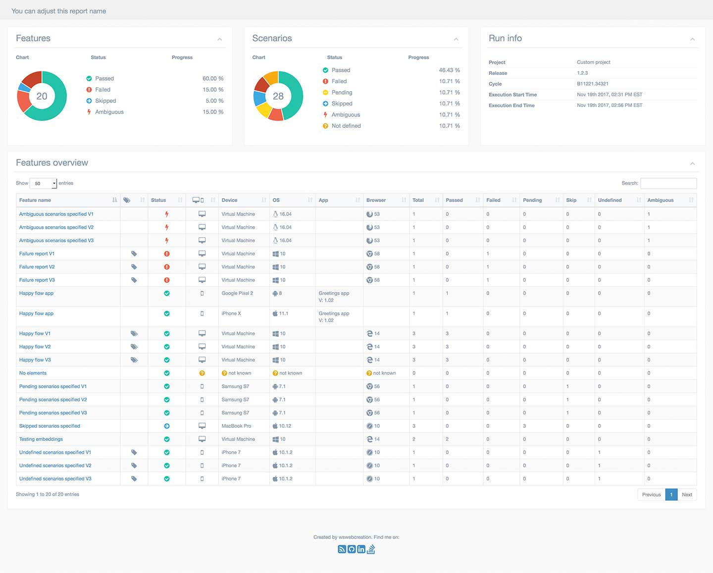

Multiple Cucumber HTML Reporter is a powerful reporting module for Cucumber that transforms standard JSON output into a beautiful, interactive, and highly detailed HTML report.

Unlike many other reporting modules, this module provides:

- **Quick Overview**: A high-level summary of all tested features and scenarios.
- **Multiple Runs Support**: Ability to hold multiple runs of the same feature or runs Across different browsers and devices.
- **Interactive Search**: Easily search, filter, and sort through your features and results.
- **Metadata Rich**: Detailed insights into the browser, version, platform, and device used for each test run.
- **Dark Mode Support**: Beautifully designed UI with native support for dark mode.

## Sample Report

Experience the reporter in action through our live samples:

<Cards>
  <Card 
    title="Standard Browser Report" 
    href="https://wasiqb.github.io/multiple-cucumber-html-reporter/browsers/index.html"
    description="View a sample report with browser-specific metadata."
  />
  <Card 
    title="Custom Metadata Report" 
    href="https://wasiqb.github.io/multiple-cucumber-html-reporter/custom-metadata/index.html"
    description="Explore reports with fully customized metadata columns."
  />
</Cards>

## Feature Highlights

### Why choose this reporter?

1. **Rich Metadata**: See exactly where your tests ran without digging into logs.
2. **Flexible Integration**: Works with CucumberJS 1, 2, 3, and 4.
3. **Customizable**: Add your own data blocks, custom styles, and branding.
4. **Detailed Scenarios**: Drill down into specific steps, attachments, and error messages.
